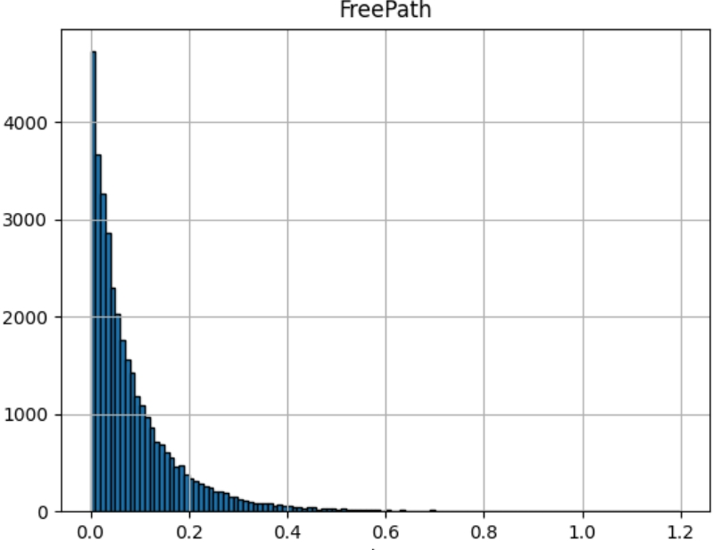
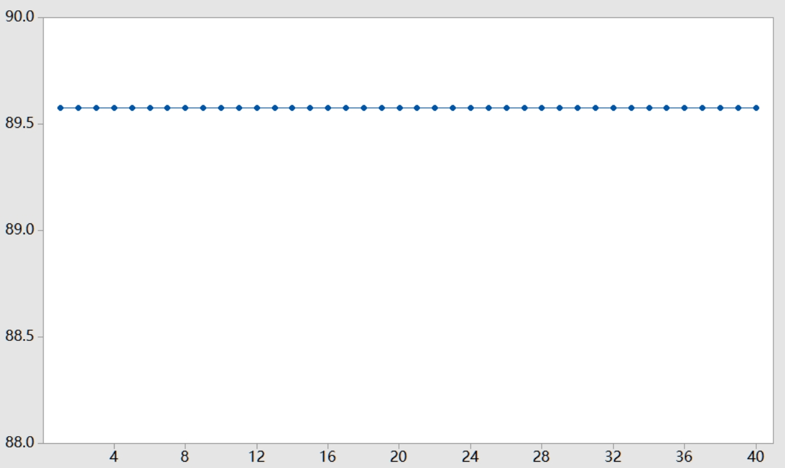

# Molecular Dynamics Simulation of Hard Spheres

## Introduction

This is the Midterm Project for **Midterm Project of CS1501 Algorithm Implementation**.
Please Note that DO NOT plagiarize this assignment, it is better for you and me.
Any suggestions is welcome to show.

## TO-DO List

1. - [x] Brownian motion
2. - [x] Free path and free time
3. - [x] Collision frequency
4. - [x] Root mean-square velocity
5. - [x] Maxwell-Boltzmann distribution
6. - [X] Pressure
7. - [x] Temperature
8. - [ ] Diffusion
9. - [x] Time reversibility
10. - [ ] Maxwell's demon

## Things After Computation

### Brownian motion

In 1827, the botanist Robert Brown observed the motion of wildflower pollen grains immersed 
in water using a microscope. He observed that the pollen grains were in a random motion, following 
what would become known as Brownian motion. This phenomenon was discussed, but no convincing 
explanation was provided until Einstein provided a mathematical one in 1905. 
Einstein's explanation: the motion of the pollen grain particles was caused by millions of 
tiny molecules colliding with the larger particles. He gave detailed formulas describing the 
behavior of tiny particles suspended in a liquid at a given temperature. Einstein's explanation 
was intended to help justify the existence of atoms and molecules and could be used to estimate 
the size of the molecules. Einstein's theory of Brownian motion enables engineers to compute the 
diffusion constants of alloys by observing the motion of individual particles.

It can be seen from the images:
(Using the parameter: draw = true, drawFreq = 2, drawPause = 20, dataset = brownian.txt,
boxSize = 10, scaleX = [0,10], scaleY = [0,10],t_max = 4000)

And Also refer to the gifs:

Our simulation successfully replicates the key features of Brownian motion described by Einstein.
The consistency with expected random motion and diffusion patterns confirms the validity of 
our simulation.

### Free path and free time
Free path = distance a particle travels between collisions. Plot histogram. 
Mean free path = average free path length over all particles. As temperature 
increases, mean free path increases (holding pressure constant). Compute free 
time length = time elapsed before a particle collides with another particle 
or wall.

Using our generator data in the oxygen with 100 particles:

(Once Experiment)

Mean Free Path: 0.0793440898863433

Free time length 0.012701064240002875

For one random particles:

Its distribution is consistent with an exponential decay.

### Collision frequency

Number of collisions per second

We can store the time interval between two events, then we can calculate the SUM
of the intervals. Then it can be calculated as:

f = N / sum(delta t)

Evaluted the same data from above, it is:

Collision Frequency: 84.43219846308577

Actually, because the destiny of the actual oxygen is larger than the cyber oxygen, it will be more huge.

### Root mean-square velocity

Root mean-square velocity / mean free path = collision frequency. 
Root mean square velocity = sqrt(3RT/M) where molar gas constant 
R = 8.314 J / mol K, T = temperature (e.g., 298.15 K), 
M = molecular mass (e.g., 0.0319998 kg for oxygen).

Because the density difference in the cyber and real world, it is hard to simulate.

Root mean-square(calculation) velocity is 276.37900138840604, in the 98 K, real world root mean-square velocity.

But we can still see the rules:

(Under 1000 particles in the system)

Mean Free Path: 0.003420598196313502

Collision Frequency: 4012.0051293082324

Root mean-square(experiment) velocity is 13.723457508912258

(Under 10000 particles in the system)

Mean Free Path: 2.785424967777829E-4

Collision Frequency: 299965.78059994325

Root mean-square(experiment) velocity is 83.55321747620484

The destiny which is hard to actually simulate in the real world.

### Maxwell-Boltzmann distribution

Distribution of velocity of particles in hard sphere model obey 
Maxwell-Boltzmann distribution (assuming system has thermalized 
and particles are sufficiently heavy that we can discount 
quantum-mechanical effects). Distribution shape depends on 
temperature. Velocity of each component has distribution 
proportional to exp(-mv_x^2 / 2kT). Magnitude of velocity in 
d dimensions has distribution proportional to v^(d-1) exp(-mv^2 /
2kT). Used in statistical mechanics because it is unwieldy 
to simulate on the order of 10^23 particles. 
Reason: velocity in x, y, and z directions are
normal (if all particles have same mass and radius). 
In 2d, Rayleigh instead of Maxwell-Boltzmann.

We Generate the particles which vx and vy are follow the **Maxwell-Boltzmann distribution**
The particles are distributed in the space uniformlly and we assume that
they are reached the heat balance. After some period of time, it keep heated balanced.
Then we calculated their velocities in x and y axis, s.t., it follows the 
Rayleigh distribution. Our result stands the assumption. It also follow the
rules with temperature and velocity.

- T = 98K,m = 5.23e-23 kg(Oxygen)

The reuslts:

Except average: 32.42406467694316

Except sigma: 287.26219002149077

Calculated average: 34.06304096182403

Calculated sigma: 285.2458754371474

- T = 298K,m = 5.23e-23 kg(Oxygen)

The reuslts:

Except average: 98.5956252421333

Except sigma: 2656.1882051924686

Calculated average: 89.61811894418628

Calculated sigma: 2461.709990113346

And in T = 98 K, the hist plot can be shown:
- Maxwell Distribution in x and y-axis

- Rayleigh Distribution in 2-D space

The long-tail effect can not be eliminated due to the algorithm itself.
### Pressure
Using the virial sum, we can evaluated a heated balanced system's pressure.

in a 10 * 10 box with N = 100 particles:

Pressure: 62.40577155014349

in a 100 * 100 box with N = 100 particles:

Pressure: 0.0050962863156554464

These values are consistent with physical expectations. For an ideal gas, as 
the volume increases with a constant number of particles, the pressure decreases proportionally, 
which is observed in your results. The actual magnitude of the pressures can vary based on the specific 
dynamics of the simulation and the chosen units, but the trend should align with this inverse relationship.

### Temperature
Temperature. Plot temperature over time (should be constant) = 1/N sum(mv^2) /
(d k), where d = dimension = 2, k = Boltzmann's constant.

First we can use the Maxwell-Boltzmann distribution to generate the
particles under the specific temperature.

In 98K, by once experiment:

Expected temperature: 98.0

Calculated temperature: 99.45088318614972

And Also we can Plot the temperature

### Diffusion

The Red particles will distribute avarge in the green particles in the under gif.

### Time reversibility

We can move the events in to a specific steps, e.g. , 40 steps, and then we reverse all the particles in the same
velocity value but in a inverse direction. Then start the simulation again to see the reverse.

Results:

INTX:0.38

INTY:0.8

steps: 40

Reverse all the particles

Reverse steps: 40

After Reverse 1st Particles Position x: 0.38

After Reverse 1st Particles Position y: 0.8

Because there still has the calculation loss in double, so it is not perform where well in the long steps.

### Maxwell's demon
