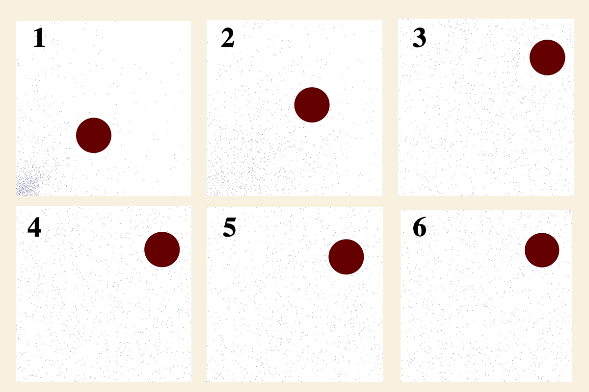
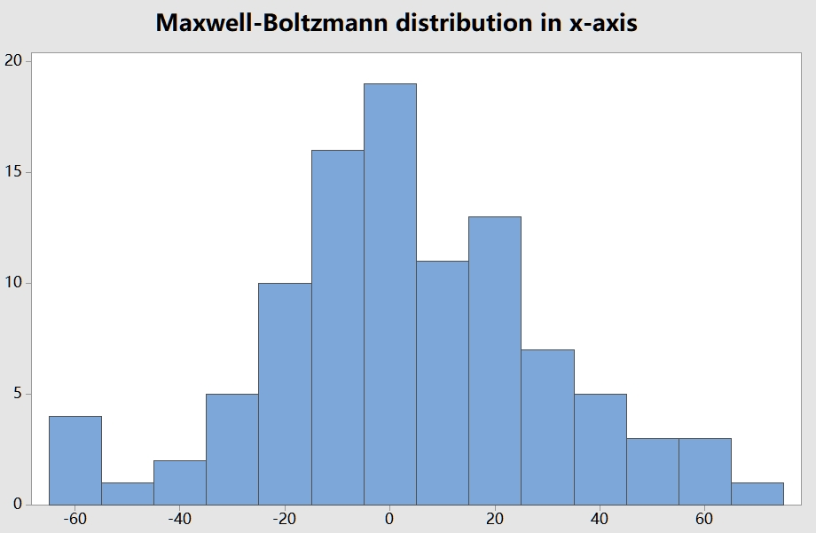
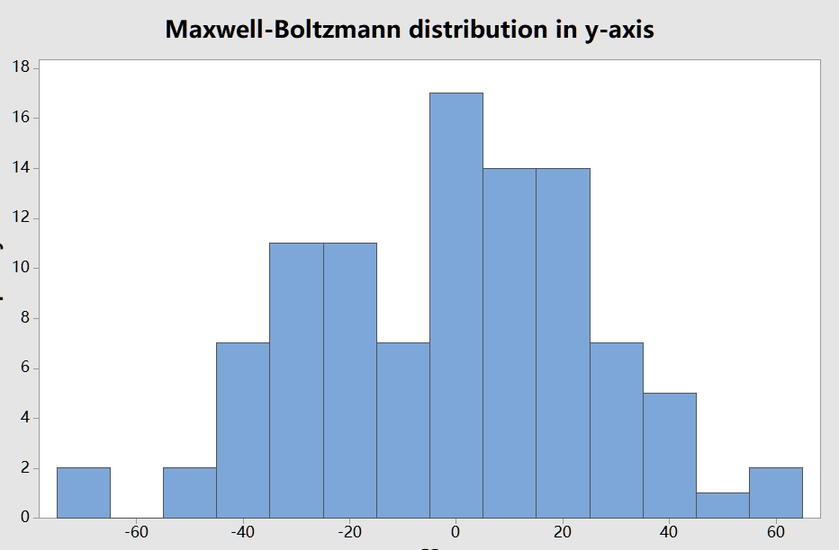
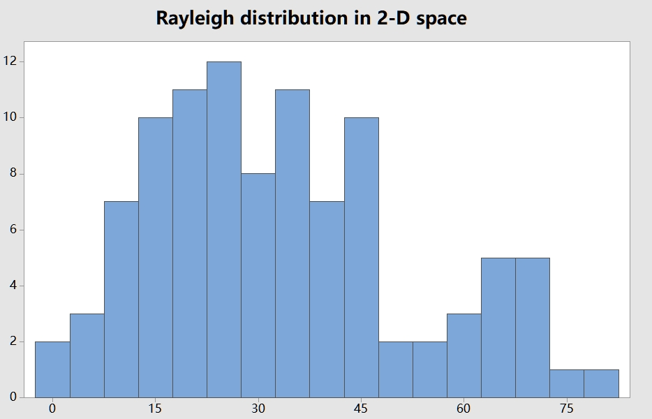

# Molecular Dynamics Simulation of Hard Spheres

## Introduction

This is the Midterm Project for **Midterm Project of CS1501 Algorithm Implementation**.
Please Note that DO NOT plagiarize this assignment, it is better for you and me.
Any suggestions is welcome to show.

## TO-DO List

1. - [x] Brownian motion
2. - [x] Free path and free time (No hist!)
3. - [x] Collision frequency
4. - [x] Root mean-square velocity
5. - [x] Maxwell-Boltzmann distribution
6. - [ ] Pressure
7. - [ ] Temperature
8. - [ ] Diffusion
9. - [ ] Time reversibility
10. - [ ] Maxwell's demon

## Things After Computation

### Brownian motion

In 1827, the botanist Robert Brown observed the motion of wildflower pollen grains immersed 
in water using a microscope. He observed that the pollen grains were in a random motion, following 
what would become known as Brownian motion. This phenomenon was discussed, but no convincing 
explanation was provided until Einstein provided a mathematical one in 1905. 
Einstein's explanation: the motion of the pollen grain particles was caused by millions of 
tiny molecules colliding with the larger particles. He gave detailed formulas describing the 
behavior of tiny particles suspended in a liquid at a given temperature. Einstein's explanation 
was intended to help justify the existence of atoms and molecules and could be used to estimate 
the size of the molecules. Einstein's theory of Brownian motion enables engineers to compute the 
diffusion constants of alloys by observing the motion of individual particles.

It can be seen from the images:
(Using the parameter: draw = true, drawFreq = 2, drawPause = 20, dataset = brownian.txt,
boxSize = 10, scaleX = [0,10], scaleY = [0,10],t_max = 4000)

And Also refer to the gifs:

Our simulation successfully replicates the key features of Brownian motion described by Einstein.
The consistency with expected random motion and diffusion patterns confirms the validity of 
our simulation.

### Free path and free time
Free path = distance a particle travels between collisions. Plot histogram. 
Mean free path = average free path length over all particles. As temperature 
increases, mean free path increases (holding pressure constant). Compute free 
time length = time elapsed before a particle collides with another particle 
or wall.

We can store the distance interval between two events, also the time intervals.
Evaluating the Collision with brownian dataset, Boxsize is 10 in t_max 4000.

Mean Free Path: 9.628867535876509E-4

Mean Free Time: 0.010477422440390472

### Collision frequency

Number of collisions per second

We can store the time interval between two events, then we can calculate the SUM
of the intervals. Then it can be calculated as:

f = N / sum(delta t)

Where N is the number of intervals and delta t is each interval length.

Evaluating the Collision Frequency with brownian dataset, BoxSize is 10 in t_max 4000,
The Collision frequency is 7.050855584767143

### Root mean-square velocity

Root mean-square velocity / mean free path = collision frequency. 
Root mean square velocity = sqrt(3RT/M) where molar gas constant 
R = 8.314 J / mol K, T = temperature (e.g., 298.15 K), 
M = molecular mass (e.g., 0.0319998 kg for oxygen).

Because the dataset is in the huge world, it is hard to simulate.

In the brownian dataset, the v_rms = 0.00538756856004553

And for Oxygen in 298.15K, hte v_rms = 482.069

### Maxwell-Boltzmann distribution
Distribution of velocity of particles in hard sphere model obey 
Maxwell-Boltzmann distribution (assuming system has thermalized 
and particles are sufficiently heavy that we can discount 
quantum-mechanical effects). Distribution shape depends on 
temperature. Velocity of each component has distribution 
proportional to exp(-mv_x^2 / 2kT). Magnitude of velocity in 
d dimensions has distribution proportional to v^(d-1) exp(-mv^2 /
2kT). Used in statistical mechanics because it is unwieldy 
to simulate on the order of 10^23 particles. 
Reason: velocity in x, y, and z directions are
normal (if all particles have same mass and radius). 
In 2d, Rayleigh instead of Maxwell-Boltzmann.

We Generate the particles which vx and vy are follow the **Maxwell-Boltzmann distribution**
The particles are distributed in the space uniformlly and we assume that
they are reached the heat balance. After some period of time, it keep heated balanced.
Then we calculated their velocities in x and y axis, s.t., it follows the 
Rayleigh distribution. Our result stands the assumption. It also follow the
rules with temperature and velocity.

- T = 98K,m = 5.23e-23 kg(Oxygen)

The reuslts:

Except average: 32.42406467694316

Except sigma: 287.26219002149077

Calculated average: 34.06304096182403

Calculated sigma: 285.2458754371474

- T = 298K,m = 5.23e-23 kg(Oxygen)

The reuslts:

Except average: 98.5956252421333

Except sigma: 2656.1882051924686

Calculated average: 89.61811894418628

Calculated sigma: 2461.709990113346

And in T = 98 K, the hist plot can be shown:
- Maxwell Distribution in x and y-axis

- Rayleigh Distribution in 2-D space

The long-tail effect can not be eliminated due to the algorithm itself.
### Pressure

### Temperature

### Diffusion

### Time reversibility

### Maxwell's demon
